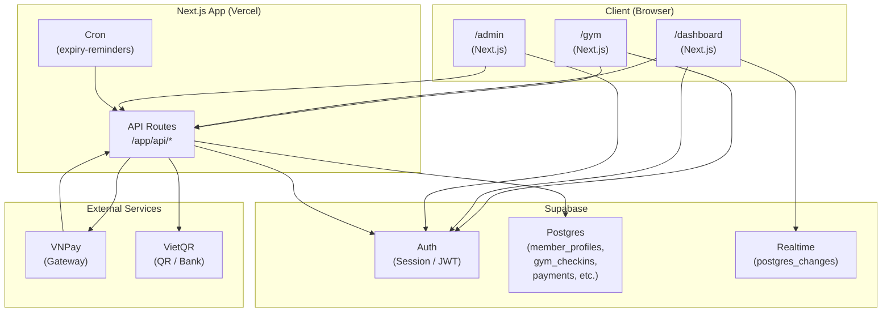

# Full Flow: /gym, /dashboard, /admin — Technical Reference

This document describes **every page**, **user interaction**, **API**, **auth**, and **data flow** for the gym, dashboard, and admin areas.

---

## 1. Application structure

### 1.1 Layout and providers

- **Root** (`app/layout.tsx`): Wraps the app in `AuthProvider` and `InAppBrowserProvider`. `LandingGate` wraps `children`.
- **AuthProvider** (`context/AuthContext.tsx`): Global. Holds Supabase **session**, **user**, **member** (from `GET /api/member/me`), **loading**, **accessToken**, **refresh()**, **signOut()**. On mount and on `onAuthStateChange`, calls `getSession()` (with retries 0/150/400 ms) then `fetchMember(token)`. Single source of truth for member auth; no redirects until `loading === false`.
- **LandingGate** (`components/LandingGate.tsx`): Path-dependent rendering:
  - **Home** (`/`, `/en`, `/vi`): Renders `LandingFlow` (hero, Explore, etc.).
  - **Gym or Dashboard** (path includes `/gym` or `/dashboard`): Renders `children` immediately and adds `loaded` to `document.body` (no loading screen).
  - **Other routes**: Shows `LoadingScreen` and a script that removes it after 2s and adds `loaded`.
- **Locale routes**: Under `app/[locale]/` (e.g. `en`, `vi`). Used by gym, dashboard, waiver, login, signup, etc.
- **Dashboard layout** (`app/[locale]/dashboard/layout.tsx`): Wraps dashboard in `ProtectedRoute`.
- **ProtectedRoute** (`components/ProtectedRoute.tsx`): Uses `useAuth()`. If `loading` → shows `LoadingScreen`. If `!session` → `router.replace("/")`. Only renders children when there is a session.
- **Admin** (`app/admin/layout.tsx`): Wraps admin in `AdminAuthProvider` only (no locale in path).
- **AdminAuthProvider** (`components/admin/AdminAuthContext.tsx`): Own state: **session**, **loading**. On mount: `getSession()`, then subscribes to `onAuthStateChange`. **isAdmin** = session exists and `isAdminEmail(session.user.email)`. Exposes **signIn(email, password)** (Supabase `signInWithPassword`; if not admin email, signs out and returns error), **signOut**, **adminFetch(url, init)** (adds `Authorization: Bearer <session.access_token>`). Admin login is **Supabase Auth** in the browser; no call to `POST /api/admin/login` from the UI (that route exists for other use if needed).

### 1.2 Auth summary

| Area        | Provider           | Who can access              | Session source                    |
|------------|--------------------|-----------------------------|-----------------------------------|
| Gym, Dashboard, Waiver, Membership flow | AuthProvider       | Any user; dashboard/waiver require session | Supabase Auth (cookie/session)    |
| Admin      | AdminAuthProvider  | Only `ADMIN_EMAILS` (e.g. admin001@gym.local) | Same Supabase Auth; checked by `isAdminEmail()` |

---

## 2. `/gym` — Full detail

### 2.1 Route and entry

- **Path:** `/[locale]/gym` (e.g. `/en/gym`, `/vi/gym`).
- **File:** `app/[locale]/gym/page.tsx` → dynamically imports `GymWorld` (no SSR), loading fallback `LoadingScreen`.
- **Auth:** Not required. Page is public. When a user has a Supabase session, `AuthProvider` runs and `useMemberAuth()` (i.e. `useAuth()`) triggers **GET `/api/member/me`** wherever it’s used (header and chapter overlay).

### 2.2 Page structure (GymWorld)

- **Component:** `components/gym/GymWorld.tsx`.
- **State:** `visitModalOpen`, `membershipEntryOpen`, `aboutModalOpen`, `locationModalOpen`, `pricingModalOpen`, scroll progress, theme (sky), active chapter. Scroll updates are paused when `membershipEntryOpen` is true.
- **Children:**
  - **GymHeader** (fixed): Logo (link to `/[locale]`), nav: About, Location, Pricing; if not logged in → Membership (opens sheet); if logged in → Dashboard link, Logout. Uses `useMemberAuth()` and `useGymNav()`.
  - **GymScrollScene**: 3D island + **GymChaptersOverlay** (text + CTAs per chapter).
  - **GymFooter**
  - **GymTransitionOverlay** (optional transition)
  - **GymNavProvider** wraps the above and provides: `openAboutModal`, `openLocationModal`, `openPricingModal`, `openMembershipModal` (set state in GymWorld that opens the corresponding modal/sheet).

### 2.3 Modals and sheets on /gym

- **GymVisitModal**: Opened from nav/context. Form or CTA for “book a visit”. Submits to **POST `/api/gym/visit-request`** (or similar).
- **MembershipEntrySheet**: Bottom sheet. Main entry for “join / login”. Views: main, claim, login, signup, signup_check_email, not_found, rate_limit, has_account. See “Membership entry sheet” below.
- **LocationSheet**: Location info (no API).
- **PricingSheet**: Pricing info (no API).
- **AboutUsModal**: About Leo Mây (no API).

### 2.4 Chapter overlay CTAs (GymChaptersOverlay)

- **Intro chapter:** “About Leo Mây” → `openAboutModal()`.
- **Gym chapter:** Location title → `openLocationModal()`.
- **Community chapter:** Pricing title → `openPricingModal()`.
- **Membership chapter:** “Become a Member” → `openMembershipModal()` (opens MembershipEntrySheet).

When **logged in**, the **header** shows “Dashboard” and “Logout” instead of “Membership”; the chapter CTA remains “Become a Member” for the membership section.

### 2.5 APIs called from /gym

- **GET `/api/member/me`**: When there is a session, from `AuthProvider` (used by header and any consumer of `useMemberAuth()`). Returns member profile or 401/404.

### 2.6 /gym/membership

- **Path:** `/[locale]/gym/membership`.
- **File:** `app/[locale]/gym/membership/page.tsx`. Only runs `router.replace(\`/${locale}/gym\`)` and shows “Redirecting…”. Membership entry is **only** in the gym page via **MembershipEntrySheet**; the route exists only to redirect to `/gym`.

---

## 3. Membership entry sheet (on /gym) — Full detail

**Component:** `components/gym/modals/MembershipEntrySheet.tsx`. Opened from header “Membership” or chapter “Become a Member”.

### 3.1 Views and flows

- **Main:** “Join the sky” copy; “New here?” → Create Account (signup); “I have an account” → Login. “Claim your account” (pre-launch) → claim form.
- **Claim (pre-launch):** Email or phone → **POST `/api/auth/claim-waitlist`** with `{ email? or phone?, locale, origin }`.
  - **Not in waitlist (404):** Show “not_found” view.
  - **Rate limit (429):** Show “rate_limit” view.
  - **Already has account (`hasAccount: true`):** Show “has_account” view; if email is test (`evN-*@l`, `dummy2N@test.local`), immediately call **POST `/api/auth/dev-bypass-gym`** and redirect to magic link; else user can enter password and submit → `signInWithPassword` then close, refresh, `router.replace(\`/${locale}/dashboard\`)`.
  - **New account created:** Response includes `url` (magic link) → `window.location.href = url` (user verifies in email, lands on `/${locale}/dashboard`).
- **Login:** Email/phone + password. Test emails: **POST `/api/auth/dev-bypass-gym`** first; if 200 and `data.url` → redirect to magic link. Else: `signInWithPassword`; on success → close, refresh, `router.replace(\`/${locale}/dashboard\`)`. If sign-in fails and input is email, **POST `/api/auth/claim-waitlist`**; if response has magic link → redirect; if `hasAccount` → show error (invalid credentials). Phone: **POST `/api/auth/claim-waitlist`** with phone; if magic link → redirect; if hasAccount + email → `signInWithPassword` with that email and password.
- **Signup:** Name, email, phone, gender, password. Optional: **POST `/api/auth/claim-waitlist`** first (if returns magic link, redirect). Then **Supabase `signUp`**. If no session (e.g. email confirmation required) → “signup_check_email” view with OTP input; user can resend (Supabase `resend`) or verify OTP (`verifyOtp`), then **POST `/api/member/onboard`** with Bearer token and body `{ full_name, email, phone?, gender? }` → close, refresh, `router.replace(\`/${locale}/dashboard\`)`. If session present immediately after signUp → same onboard call → dashboard.
- **Forgot password:** Opens `ForgotPasswordModal` (sends reset via Supabase); no API beyond Supabase.

### 3.2 APIs used by membership sheet

| API | Method | When |
|-----|--------|------|
| `/api/auth/claim-waitlist` | POST | Claim (email/phone), login fallback (email), signup optional |
| `/api/auth/dev-bypass-gym` | POST | Test emails on claim “has account” and on login (magic link, no password) |
| `/api/member/onboard` | POST | After signup when session exists (or after OTP verify) |

---

## 4. Auth APIs (member flow)

### 4.1 POST /api/auth/claim-waitlist

- **Body:** `{ email?, phone?, locale?, origin? }`. Email or phone required. `origin` = client origin for magic link redirect.
- **Logic:** Look up **waitlist** by email or phone. If not found → 404 (or if email and found in **member_profiles** with auth_id → return `hasAccount: true, email`). If waitlist row has **auth_id** → return `hasAccount: true, email`. Else: create Supabase user (`auth.admin.createUser`), update waitlist `auth_id`, insert **member_profiles** (tier from waitlist `tier_level` via evolution levels), generate magic link to `origin/${locale}/dashboard` → return `{ url, magicLinkUrl }`. Rate limits can return 429.
- **Used by:** Membership sheet (claim, login fallback, optional signup).

### 4.2 POST /api/auth/dev-bypass-gym

- **Body:** `{ email, locale?, origin? }`. Email must match test pattern: `evN-*@l` or `dummy2N@test.local`.
- **Allowed when:** `NEXT_PUBLIC_DEV_BYPASS_OTP=true` or host is Vercel preview and email is test.
- **Logic:** Load waitlist by email; must exist and `is_verified === true`. Generate magic link to `origin/${locale}/dashboard`. If Supabase user doesn’t exist, create user, link waitlist, insert **member_profiles**, then generate link. Return `{ url }`.
- **Used by:** Membership sheet for test-account login/claim (no password).

### 4.3 GET /api/member/me

- **Headers:** `Authorization: Bearer <access_token>`.
- **Logic:** Validate token with Supabase `getUser`. Read **member_profiles** by `auth_id`. If no row, try **waitlist** by `auth_id` (or by email); if found, insert **member_profiles** (tier from waitlist) and use it. Compute `total_visits` (count **gym_checkins**) and `last_checkin` (latest check-in). Return `{ member }` with profile + `total_visits`, `last_checkin`. 401 if no/invalid token; 404 if no member and no waitlist.
- **Used by:** AuthProvider (so every page under AuthProvider that has a session gets member). Used by /gym (header/overlay), /dashboard, /waiver, membership flow.

### 4.4 POST /api/member/onboard

- **Headers:** `Authorization: Bearer <access_token>`.
- **Body:** `{ full_name, email?, phone?, gender? }`.
- **Logic:** Resolve user from token. If **member_profiles** already exists for this auth_id → 200 ok. Else insert **member_profiles** with tier `Explorer`, `membership_status: "inactive"`. Return `{ ok: true, member_id }`.
- **Used by:** Signup (and signup + OTP verify) in MembershipEntrySheet.

---

## 5. /waiver — Full detail

### 5.1 Route and guards

- **Path:** `/[locale]/waiver`.
- **File:** `app/[locale]/waiver/page.tsx`.
- **Auth:** `useMemberAuth()`. No ProtectedRoute wrapper; page does its own redirects:
  - `loading` → show “Loading…”.
  - `!user` → `router.replace(\`/${locale}/gym\`)`.
  - `member?.waiver_signed` → `router.replace(\`/${locale}/dashboard\`)`.
  - `user && !member` → `router.replace(\`/${locale}/dashboard\`)`.

### 5.2 UI and interaction

- Title “Climbing Activity Waiver”.
- Button “Open Waiver” → opens modal with full **WAIVER_TEXT** (scrollable). User must scroll to bottom; then “Agree & Sign Waiver” enables. On agree: set `agreed`, `canSign`, close modal, focus full name input.
- Form: full name, checkbox (agreed), signature. Signature mode: “Type” (text) or “Draw” (WaiverSignaturePad). Submit → **POST `/api/member/waiver`** with Bearer token and `{ full_name, agreed, signature_data, waiver_text }`. On success → `window.location.href = \`/${locale}/dashboard\`` (full page redirect).

### 5.3 POST /api/member/waiver

- **Headers:** `Authorization: Bearer <access_token>`.
- **Body:** `{ full_name, agreed, signature_data?, waiver_text? }`.
- **Logic:** Resolve user; get **member_profiles** by auth_id. Update profile: `waiver_signed: true`, `waiver_signed_at: now`, `full_name`. If `waiver_text` provided, insert **member_waivers** (member_id, full_name, waiver_text, signature). Return 200.

---

## 6. /dashboard — Full detail

### 6.1 Route and protection

- **Path:** `/[locale]/dashboard`.
- **Layout:** `ProtectedRoute` → if no session, redirect to `"/"`; if loading, show LoadingScreen.
- **Page:** `app/[locale]/dashboard/page.tsx`. Uses `useMemberAuth()`. If **member** is null (e.g. still loading or no profile) → show “Setting up your profile…” and Retry button (calls `refresh()`). No redirect to waiver here; page renders and shows waiver card if `!member.waiver_signed`.

### 6.2 Dashboard content and user actions

- **Header:** Logo, language toggle (EN/VN), Logout. Language change: store `leo_language` in localStorage, `router.replace(\`/${target}/dashboard\`)`.
- **Greeting:** “Welcome back, {name}” / “Chào lại, {name}”. Tapping opens **ProfileModal** (edit profile, set password, profile photo). Profile updates via **POST `/api/member/profile`** (and password via Supabase `updateUser`).
- **Payment success banner:** When URL has `vnp_ResponseCode=00` (VNPay return), show “Payment Successful”, call `refresh()`, clean URL. Same for **check-in success** when Realtime fires for new **gym_checkins** row.
- **Check-in requirements notice:** 3 steps: (1) waiver, (2) active pass (day or visit), (3) profile photo. Progress bar and message until all done.
- **Waiver card:** If `!member.waiver_signed`, show “Safety Waiver” card with button “Open Waiver” → **WaiverModal** (inline waiver sign; on success `refresh()`).
- **CHECK IN block:** Shown when `canShowQR` (waiver signed, canCheckIn, profile_photo_url). QR value: `origin/api/checkin?member_id=<id>` or `leo-member:<id>`. Tap → fullscreen QR modal (wake lock while open). Last check-in time shown.
- **Gym status:** Fetches **GET `/api/admin/occupancy`** (no auth). That route requires admin; so for a normal member the request returns 401 and occupancy is not set (shows “Loading gym status…” or similar).
- **Membership card:** Tier, status, valid until, member ID, visits/days remaining, progress bar. Freeze/Unfreeze → **POST `/api/member/membership`** with `action: "freeze"` or `"unfreeze"` (Bearer). Pay / Renew: list of plans from **GET `/api/plans`** (public). Filter: All / Day / Visit. Tap plan → **PackageDetailModal**; “Buy” → **GET `/api/member/vietqr?plan_id=...`** (Bearer) → **PaymentModal** (VietQR image or VNPay button). VNPay: **GET `/api/member/vnpay?plan_id=...&return_url=...`** (Bearer) → redirect to VNPay; return URL is `/${locale}/dashboard` with vnp_ params. Payment history: **GET `/api/member/payments`** (Bearer). Realtime: subscribe to **payments** and **gym_checkins** for this member; on INSERT → set payment/check-in success banner and `refresh()`.
- **Climbing activity:** Visits this month, “monthly streak”, reward progress (e.g. sessions/8).
- **Upcoming events:** Static list `DASHBOARD_EVENTS`; tap → **EventDetailModal** (RSVP via **POST `/api/member/event-rsvp`** if needed).
- **Community leaderboard:** **GET `/api/member/leaderboard?gender=...`** (Bearer). Filter: All / Male / Female. Shows top list and current user rank.
- **Footer:** Instagram, Contact, Rules link.
- **Logout:** `signOut()` then `window.location.href = \`/${locale}/gym\`` or `router.replace(\`/${locale}/gym\`)`.

### 6.3 APIs used by dashboard

| API | Method | Auth | Purpose |
|-----|--------|------|--------|
| `/api/member/me` | GET | Bearer | Via AuthProvider; member + total_visits, last_checkin |
| `/api/admin/occupancy` | GET | Admin Bearer | Occupancy count; **returns 401 for members** (no admin token) |
| `/api/plans` | GET | — | List plans (public) |
| `/api/member/payments` | GET | Bearer | Payment history |
| `/api/member/vietqr` | GET | Bearer | VietQR URL for plan purchase |
| `/api/member/vnpay` | GET | Bearer | VNPay redirect URL |
| `/api/member/membership` | POST | Bearer | Freeze / unfreeze |
| `/api/member/profile` | PATCH | Bearer | Update profile (and photo) |
| `/api/member/leaderboard` | GET | Bearer | Leaderboard + current user |
| `/api/member/event-rsvp` | POST | Bearer | Event RSVP (if used) |

### 6.4 Realtime (dashboard)

- **Channel:** `payments-${member.id}` on table **payments**, event INSERT, filter `member_id=eq.${member.id}`. On event: set payment success banner, `refresh()`, clear banner after 8s.
- **Channel:** `checkins-${member.id}` on table **gym_checkins**, event INSERT, filter `member_id=eq.${member.id}`. On event: set check-in success banner, `refresh()`, clear after 8s.

---

## 7. Check-in — Shared by member QR and admin

### 7.1 Check-in API

- **POST /api/checkin**  
  **Body:** `{ member_id, location? }`.  
  **GET /api/checkin?member_id=xxx**  
  Same logic as POST; used when the member’s QR encodes the URL (e.g. `origin/api/checkin?member_id=<id>`). No auth on this route; trusted use (staff scan or member’s device opens link).

**Logic (shared):**

1. Load **member_profiles** by id; 404 if not found.
2. Enforce: `waiver_signed`, `profile_photo_url` present, membership valid (day pass: `membership_status === 'active'` and expiry > now; or visit pass: `visits_remaining > 0`). 403 if not.
3. Insert **gym_checkins** (member_id, location).
4. If visit pass: decrement **member_profiles.visits_remaining** and update `updated_at`.
5. Return 200. Realtime on **gym_checkins** causes dashboard to show “Check-in successful” and refresh.

### 7.2 Who triggers check-in

- **Member:** Shows QR on dashboard; staff scans QR (or opens link) → GET or POST to `/api/checkin` with that member_id.
- **Admin:** After finding member (by ID, code, or name), “Check In” or “Manual Check-In” → **POST /api/checkin** with `member_id` and `location: "front_desk"` or `"front_desk_manual"`. QR scanner in admin: scans member’s QR → parses `leo-member:<id>` or URL → same **POST /api/checkin** (or GET with member_id), then loads member in admin UI.

---

## 8. /admin — Full detail

### 8.1 Route and auth

- **Path:** `/admin` (no locale).
- **Layout:** `AdminAuthProvider` only.
- **Page:** `app/admin/page.tsx`. If `loading` → “Loading…”. If `!isAdmin` → render **AdminLoginForm** (email, password; `signIn` from context = Supabase `signInWithPassword`; only admin emails succeed). No separate call to `POST /api/admin/login` in the form.

### 8.2 Admin UI and actions

- **Header:** Title, subtitle, locale toggle (EN/VN stored in `admin-locale`), gym occupancy badge (polled **GET `/api/admin/occupancy`** every 15s), Logout.
- **Member lookup:** Modes: Member ID (code, e.g. LM-XXXX), Name, QR. Search input; “Search” or “Scan QR”.  
  - **Search:** **GET `/api/admin/members?id=...`** or `?code=...` or `?name=...`** (all require admin Bearer). Name search returns **members** array; user selects one → **GET `/api/admin/members?id=...`** to load full member.  
  - **Scan QR:** Opens **QrScannerModal**; on scan, parse payload (leo-member:id or URL with member_id), then **POST /api/checkin** (or GET) to record check-in, then **loadMemberById** to show member.
- **Member profile (when found):** Photo, name, email/phone, Member ID, membership type, valid until, gender, Instagram, govt ID, DOB, waiver signed (with “View waiver” → waiver modal). Activity: check-ins this month, total visits, visits remaining. Recent check-ins list. Recent payments (polled **GET `/api/admin/payments?member_id=...`** every 4s; on count increase → “Payment received”, reload member).
- **Check-in actions:** “Check In”, “Manual Check-In”, “Undo Check-In” (local state only; no API). Check In / Manual → **POST /api/checkin** with member_id and location.
- **Membership controls:** “Collect Payment” → opens payment modal (plan select, VietQR or Cash; **GET `/api/admin/vietqr?plan_id=...&member_id=...`**, then “Confirm Payment” → **POST `/api/admin/payments/confirm`**). “Extend (no payment)”, “Freeze”, “Cancel”, “Upgrade” → **POST `/api/admin/membership`** with `member_id` and `action`.
- **Admin tools:** Add New Member (scroll to form; form is demo-only, no API in code). Generate Day Pass (opens payment modal with day_pass). Recent Check-ins → modal with **GET `/api/admin/checkins?days=7`**. View Gym Occupancy → modal (same count as header). View Leaderboard → `window.open('/en/countdown')`. Revenue → modal **GET `/api/admin/revenue?period=day|week|month`**.
- **New member form:** Name, email, phone, membership type; submit shows “New member created (demo only)” and clears form (no backend in current code).
- **Modals:** Occupancy, Check-ins (7 days), Revenue (with period tabs), Waiver view (signed waiver text + signature), Collect Payment (plan, method, VietQR or cash, confirm), VietQR fullscreen, **QrScannerModal** (camera scan → member_id → check-in + load member).

### 8.3 Admin APIs

All require **Authorization: Bearer <admin_access_token>** and **getAdminFromRequest** (Supabase getUser + isAdminEmail).

| API | Method | Purpose |
|-----|--------|--------|
| `/api/admin/me` | GET | Admin identity (if used) |
| `/api/admin/members` | GET | id / code / name lookup; name returns list |
| `/api/admin/plans` | GET | Plans for payment modal |
| `/api/admin/payments` | GET | Payments for a member_id (polling) |
| `/api/admin/payments/confirm` | POST | Confirm payment (member_id, plan_id, method) → insert payments, update member_profiles |
| `/api/admin/vietqr` | GET | VietQR URL for plan + member_id |
| `/api/admin/membership` | POST | extend / freeze / cancel / upgrade |
| `/api/admin/checkins` | GET | Check-ins last 7 days (for modal) |
| `/api/admin/occupancy` | GET | Distinct members checked in last 2 hours |
| `/api/admin/revenue` | GET | Revenue by period (day/week/month) |

---

## 9. Data model (tables involved)

- **auth.users** (Supabase): Identity for both members and admins.
- **waitlist:** Pre-launch; `auth_id` set after verification. Used by claim-waitlist and by **GET /api/member/me** to create **member_profiles** when missing.
- **member_profiles:** One per member; `auth_id` unique. Fields used: id, auth_id, email, phone, full_name, tier, member_code, membership_status, membership_expires_at, visits_remaining, waiver_signed, waiver_signed_at, profile_photo_url, id_number, date_of_birth, instagram_handle, gender, created_at, updated_at.
- **member_waivers:** Signed waiver records (member_id, full_name, waiver_text, signature, created_at).
- **gym_checkins:** One row per check-in (member_id, location, timestamp).
- **payments:** Payments (member_id, plan_id, amount, method, status, memo, created_at).
- **membership_plans:** Plans (id, name, duration_days, duration_visits, price_vnd, pass_type, etc.).

Admin users are the same Supabase users; **lib/adminAuth.ts** defines **ADMIN_EMAILS** (e.g. admin001@gym.local). No separate admin table.

---

## 10. User flows (end-to-end)

### 10.1 New user: signup from /gym

1. Open `/[locale]/gym` → scroll or click Membership → MembershipEntrySheet opens.
2. “Create Account” → signup view → fill name, email, phone, gender, password → Submit.
3. Optional claim-waitlist; then Supabase `signUp`. If email confirmation: “Check your email” → enter OTP → verifyOtp → **POST /api/member/onboard** → redirect to dashboard. If session immediate: onboard → redirect to dashboard.
4. Dashboard: if waiver not signed, waiver card + WaiverModal; after sign → refresh. Then buy pass (VietQR/VNPay or admin confirms), add profile photo. When 3/3 (waiver, pass, photo) → QR appears for check-in.

### 10.2 Pre-launch user: claim from /gym

1. Open /gym → Membership → “Claim your account” → enter email/phone.
2. **POST /api/auth/claim-waitlist**. If not in waitlist → not_found. If has auth_id → has_account view (password or dev bypass). If new → magic link in email → click → Supabase confirms → redirect to `/${locale}/dashboard`.
3. First **GET /api/member/me** on dashboard (or gym) may create **member_profiles** from waitlist row (tier from tier_level).

### 10.3 Login (existing member) from /gym

1. Membership sheet → Login → email/phone + password. Test emails → dev-bypass magic link. Else signInWithPassword; if fail and email → claim-waitlist (magic link or has_account). On success → refresh, replace to dashboard.
2. Dashboard: waiver gate if needed; then full dashboard; QR when waiver + pass + photo done.

### 10.4 Check-in (staff)

1. **Option A:** Member shows QR on phone. Staff opens **/admin**, “Scan QR” → camera scans → payload parsed → **POST /api/checkin** with member_id → “Check-in recorded”, member loaded in admin.
2. **Option B:** Staff searches by ID or name → finds member → “Check In” or “Manual Check-In” → **POST /api/checkin**. Dashboard of that member (if open) gets Realtime and shows “Check-in successful”.

### 10.5 Payment (admin confirms)

1. Admin finds member → “Collect Payment” → select plan, VietQR or Cash → show QR or amount → customer pays → Admin “Confirm Payment” → **POST /api/admin/payments/confirm** → payments row inserted, member_profiles updated (expiry or visits_remaining). Member’s dashboard: Realtime fires → “Payment Successful”, refresh().

### 10.6 Dashboard occupancy quirk

Dashboard calls **GET /api/admin/occupancy** with no auth. That route requires admin. So for a normal member the request returns 401 and the dashboard never receives a count; occupancy section stays “Loading…” or empty. Only when the same browser has an admin session (e.g. from /admin) would the dashboard send an admin Bearer token; in practice members don’t have that. So gym occupancy on dashboard is effectively admin-only or broken for members unless a separate public/member occupancy endpoint is added.

---

## 11. File reference (quick)

| Area | Key files |
|------|-----------|
| App shell | `app/layout.tsx`, `context/AuthContext.tsx`, `components/LandingGate.tsx`, `components/ProtectedRoute.tsx` |
| Gym | `app/[locale]/gym/page.tsx`, `components/gym/GymWorld.tsx`, `GymHeader.tsx`, `GymChaptersOverlay.tsx`, `GymScrollScene.tsx`, `modals/MembershipEntrySheet.tsx`, `GymVisitModal.tsx`, etc. |
| Dashboard | `app/[locale]/dashboard/layout.tsx`, `app/[locale]/dashboard/page.tsx`, `components/dashboard/*` |
| Waiver | `app/[locale]/waiver/page.tsx`, `app/api/member/waiver/route.ts` |
| Admin | `app/admin/layout.tsx`, `app/admin/page.tsx`, `components/admin/AdminAuthContext.tsx`, `AdminLoginForm.tsx`, `QrScannerModal.tsx` |
| Auth APIs | `app/api/auth/claim-waitlist/route.ts`, `app/api/auth/dev-bypass-gym/route.ts`, `app/api/member/me/route.ts`, `app/api/member/onboard/route.ts` |
| Check-in | `app/api/checkin/route.ts` |
| Admin APIs | `app/api/admin/members/route.ts`, `app/api/admin/membership/route.ts`, `app/api/admin/payments/route.ts`, `app/api/admin/payments/confirm/route.ts`, `app/api/admin/occupancy/route.ts`, etc. |
| Config | `lib/adminAuth.ts` (ADMIN_EMAILS, getAdminFromRequest), `lib/evolutionLevels.ts` (tiers from waitlist) |

---

This document is the single technical reference for the full flow of /gym, /dashboard, and /admin, including every page, interaction, API, and data detail covered above.

---

## 12. System Architecture Overview

The Leo Mây system is a full-stack web application for gym marketing, member self-service, and staff operations. The stack is built around a **Next.js** frontend, **Supabase** for authentication and database, and **Next.js API routes** for server-side logic. Payments are integrated via **VNPay** (online gateway) and **VietQR** (bank transfer / QR display). The **admin dashboard** and **QR-based check-in** share the same database and APIs.

### 12.1 Component summary

| Component | Role |
|-----------|------|
| **Next.js frontend** | App Router; locale-based routes (`/[locale]/gym`, `/[locale]/dashboard`); admin at `/admin`. Server and client components; dynamic imports for heavy UI (e.g. GymWorld, 3D). |
| **Supabase Authentication** | Single source of identity for members and admins. Session in cookie; JWT used as Bearer token for API routes. Magic links, password sign-in, and (for dev) bypass flows. |
| **Supabase Postgres** | Primary data store: `member_profiles`, `waitlist`, `member_waivers`, `gym_checkins`, `payments`, `membership_plans`. Server-side access via `createServerClient()` in API routes. |
| **Supabase Realtime** | Postgres change events. Dashboard subscribes to `payments` and `gym_checkins` (filter by `member_id`) to show payment and check-in success without polling. |
| **API routes** | Next.js Route Handlers under `app/api/`. Member APIs require `Authorization: Bearer <token>` (Supabase JWT). Admin APIs require same header and `getAdminFromRequest` (admin email whitelist). Check-in is unauthenticated (trusted caller). |
| **VNPay** | Online payment gateway. Member or admin initiates payment via `/api/member/vnpay` or similar; user is redirected to VNPay; return URL back to dashboard; server-side IPN at `/api/vnpay-ipn` confirms payment and updates `payments` + `member_profiles`. |
| **VietQR** | Static QR / bank transfer. APIs (`/api/member/vietqr`, `/api/admin/vietqr`) return a VietQR image URL (e.g. `img.vietqr.io`). No automatic confirmation; admin confirms via **POST /api/admin/payments/confirm** or an external webhook can call `/api/payment/webhook`. |
| **Admin dashboard** | Separate UI at `/admin`; same Supabase Auth with admin-email check. Staff look up members, record check-ins, confirm payments, and run reports (occupancy, check-ins, revenue). |
| **QR-based check-in** | Member’s dashboard shows a QR encoding `leo-member:<id>` or `https://.../api/checkin?member_id=<id>`. Staff scan in admin or open link; **GET/POST /api/checkin** inserts into `gym_checkins` and (for visit passes) decrements `visits_remaining`. |

### 12.2 Architecture diagram

- **Frontend** (Gym, Dashboard, Admin) authenticates with **Supabase Auth** and calls **API routes** with the session token where required.
- **API routes** validate tokens (member or admin), read/write **Supabase Postgres**, and optionally redirect to **VNPay** or return **VietQR** URLs. **VNPay** calls back to **API** (IPN) to confirm payment.
- **Realtime** pushes changes from Postgres to the **Dashboard** for payments and check-ins.
- **Cron** (e.g. Vercel) hits an API route for scheduled tasks (expiry reminders).

---

## 13. Staff Operations Workflow

This section describes how gym staff use the system during daily operations.

### 13.1 Opening the gym

- Staff open the **admin dashboard** at `/admin` and sign in with an admin account (e.g. admin001@gym.local).
- The header shows **gym occupancy** (distinct members who checked in in the last 2 hours); at opening this is typically zero or low.
- No formal “open gym” action is required; occupancy and check-ins are driven by actual check-in events.

### 13.2 Handling check-ins

- **By QR scan:** Member shows their check-in QR (from the member dashboard). Staff tap “Scan QR” in admin, scan the code (or paste a `leo-member:<id>` / check-in URL). The system records the check-in via **POST/GET /api/checkin** and then loads that member in the admin panel. Staff can confirm the member’s name and status.
- **By lookup:** Staff enter the member’s ID (e.g. LM-XXXX) or name and search. After selecting the member, “Check In” or “Manual Check-In” records the check-in with location `front_desk` or `front_desk_manual`.
- If check-in is **denied** (e.g. waiver not signed, no valid pass, no profile photo), the API returns 403 with a clear error message; staff can inform the member to complete the missing step in the dashboard or at the waiver/payment step.
- “Undo Check-In” in admin only adjusts local UI state; it does not remove the check-in from the database.

### 13.3 Confirming payments

- When a member pays at the desk (cash or bank/VietQR), staff find the member in admin and tap **“Collect Payment”**.
- They choose the **plan** (e.g. 30 Day Pass, 5 Visit Pass), then **payment method** (VietQR or Cash). For VietQR, a QR or link is shown for the member to pay; for cash, staff collect the amount.
- After payment is received, staff tap **“Confirm Payment”**. This calls **POST /api/admin/payments/confirm** with `member_id`, `plan_id`, and `method`, which inserts a row into `payments` and updates `member_profiles` (expiry or `visits_remaining`). The member’s dashboard updates in real time via Realtime.
- For **VNPay** payments initiated by the member from the dashboard, confirmation is automatic via the **VNPay IPN** callback; staff do not need to confirm those in admin.

### 13.4 Managing members

- **Lookup:** By member ID, display code (e.g. LM-XXXX), or name search. Name search returns a list; staff select the correct member to view full profile, activity, waiver, and payments.
- **Membership controls:** From the member panel, staff can **Extend** (add one month without payment), **Freeze**, **Cancel**, or **Upgrade** membership via **POST /api/admin/membership**. These actions update `member_profiles` (status, expiry, tier).
- **View waiver:** If the member has signed the waiver, staff can open “View waiver” to see the signed text and signature from `member_waivers`.
- **Add new member:** The “Add New Member” form in admin is currently demo-only (no backend persistence). Production would require a dedicated flow (e.g. invite link or staff-created account).

### 13.5 Closing procedures

- There is no explicit “close gym” action. Staff can log out of the admin dashboard when their shift ends.
- **Occupancy** and **Recent check-ins** remain available for the next day; **Revenue** and **Check-ins** modals can be used for end-of-day or periodic reporting.
- Scheduled tasks (e.g. **expiry reminders** cron at 8:00 UTC) run independently of staff presence.

---

## 14. Edge Cases and Error Handling

### 14.1 Check-in denied

- **Cause:** Member does not meet one of: waiver signed, profile photo set, valid membership (active day pass with future expiry or visit pass with `visits_remaining > 0`).
- **API:** **POST/GET /api/checkin** returns **403** with a JSON body:
  - `"Waiver must be signed before check-in. Please complete the waiver in the dashboard."`
  - `"Profile photo required before check-in. Please complete your profile in the dashboard."`
  - `"Membership inactive or expired. Purchase a pass to check in."`
- **Staff:** Read the error in admin (or from the scanner flow) and inform the member. Member completes the missing step (waiver, photo, or purchase) in the dashboard and can try again.

### 14.2 Membership expired

- **Cause:** Day pass: `membership_status !== 'active'` or `membership_expires_at` is in the past. Visit pass: `visits_remaining <= 0`.
- **Check-in:** Same 403 as above: “Membership inactive or expired. Purchase a pass to check in.”
- **Dashboard:** Member sees status “Inactive” or “Chưa kích hoạt”, valid until in the past or “None” visits. They can purchase a new pass (VietQR/VNPay or at desk); after payment (or admin confirm), membership becomes active again and check-in is allowed.

### 14.3 Missing waiver

- **Check-in:** 403 with message that waiver must be signed in the dashboard.
- **Dashboard:** If `!member.waiver_signed`, a waiver card and WaiverModal are shown; after signing via **POST /api/member/waiver**, refresh shows the waiver as complete and (once pass and photo exist) the check-in QR.

### 14.4 Duplicate check-in

- **Behavior:** The check-in API does **not** enforce “one check-in per member per day” or per session. Each successful call inserts a new row into `gym_checkins`. So the same member can be checked in multiple times (e.g. staff scans twice, or member opens the check-in URL twice).
- **Visit passes:** Each successful check-in decrements `visits_remaining` by one. So duplicate scans reduce the member’s remaining visits multiple times.
- **Operational mitigation:** Staff should avoid scanning the same member twice; “Undo Check-In” in admin does not reverse the database insert. If duplicate check-ins or visit deductions are a concern, the backend would need to be extended (e.g. idempotency key, or “last check-in within N minutes” guard).

### 14.5 Payment failures

- **Member-initiated (VNPay):** If the user abandons or payment fails, VNPay may call **GET /api/vnpay-ipn** with a non-00 response code; the handler returns an appropriate RspCode and does not insert a payment or extend membership. The member remains in the previous state; they can retry from the dashboard.
- **Admin “Confirm Payment”:** If the request fails (network, 4xx/5xx), the admin UI can show the error; no payment or membership update is applied. Staff can retry after fixing the issue (e.g. correct plan, member_id).
- **VietQR / bank transfer:** There is no automatic confirmation. Staff confirm manually after verifying the transfer. If the webhook **POST /api/payment/webhook** is used by a gateway, failures (invalid secret, bad payload) return an error and do not update the database.

---

## 15. Security Rules

### 15.1 Admin APIs

- **Protection:** Every admin route (e.g. `/api/admin/members`, `/api/admin/membership`, `/api/admin/payments`, `/api/admin/occupancy`, `/api/admin/checkins`, `/api/admin/revenue`, `/api/admin/vietqr`, `/api/admin/plans`) calls **getAdminFromRequest(req)**.
- **Mechanism:** The route reads `Authorization: Bearer <token>`, validates the token with Supabase Auth (`getUser`), then checks **isAdminEmail(user.email)**. Only emails in the **ADMIN_EMAILS** whitelist (e.g. admin001@gym.local, admin002@gym.local, admin003@gym.local) are allowed.
- **Result:** Missing or invalid token → 401. Valid token but non-admin email → 401. Only whitelisted admin users can access admin APIs.

### 15.2 Member APIs

- **Protection:** Member routes (e.g. `/api/member/me`, `/api/member/waiver`, `/api/member/onboard`, `/api/member/profile`, `/api/member/payments`, `/api/member/vietqr`, `/api/member/vnpay`, `/api/member/leaderboard`, `/api/member/membership`) expect **Authorization: Bearer <access_token>** (Supabase JWT).
- **Mechanism:** The server validates the token with Supabase (e.g. `getUser`) and, where applicable, ensures the operation is scoped to the authenticated user (e.g. member profile by `auth_id`, payments by member_id derived from auth).
- **Result:** Invalid or expired token → 401. Valid token grants access only to that user’s data (or to create/update their own profile, waiver, etc.).

### 15.3 Check-in endpoint

- **Protection:** **GET/POST /api/checkin** do **not** require authentication. The API trusts the caller to provide a valid `member_id` (or `member_id` in the query string for GET).
- **Rationale:** Called by staff scanners (admin) or when the member’s QR link is opened (e.g. by staff device). The QR encodes the member_id; the server does not know the identity of the person calling the API.
- **Risks:** Anyone who knows or guesses a member UUID could POST a check-in for that member. Visit passes would be decremented. In a controlled environment (staff-only use of scanner and trusted network), this is accepted; for higher security, the route could be restricted (e.g. API key, or server-side scan-only flow).

### 15.4 Admin email whitelist

- **Definition:** **lib/adminAuth.ts** exports **ADMIN_EMAILS**, a fixed array of allowed emails (e.g. admin001@gym.local, admin002@gym.local, admin003@gym.local). **isAdminEmail(email)** returns true only for these addresses.
- **Usage:** Admin login is standard Supabase sign-in; the same Supabase project can have both member and admin users. After sign-in, **AdminAuthProvider** treats the user as admin only if **isAdminEmail(session.user.email)** is true; otherwise the admin UI shows the login form. All admin API routes enforce the same whitelist via **getAdminFromRequest**.
- **Change:** To add or remove admins, update **ADMIN_EMAILS** and ensure the corresponding Supabase Auth users exist (and, if applicable, are created by a seed script with a known password).

---

## 16. Analytics and Metrics

The following business metrics are supported by the current APIs and database. Queries are expressed in terms of Supabase Postgres tables and the admin/member APIs that use them.

### 16.1 Daily visitors

- **Definition:** Number of distinct members who checked in on a given day.
- **Source:** Table **gym_checkins**. Filter by `timestamp` in the date range for the day; count distinct `member_id`.
- **API:** **GET /api/admin/checkins?date=YYYY-MM-DD** (admin only) returns check-ins for that day; the client can derive distinct members from the returned list. Alternatively, a dedicated analytics query could run: `SELECT COUNT(DISTINCT member_id) FROM gym_checkins WHERE timestamp >= 'YYYY-MM-DD' AND timestamp < 'YYYY-MM-DD+1'`.

### 16.2 Active members

- **Definition:** Members with a current valid membership (e.g. active day pass with future expiry or visit pass with visits remaining).
- **Source:** Table **member_profiles**. `membership_status = 'active'` and (`membership_expires_at > now()` OR `visits_remaining > 0`). Frozen or cancelled members can be excluded by filtering on `membership_status`.
- **Query concept:** `SELECT COUNT(*) FROM member_profiles WHERE membership_status = 'active' AND (membership_expires_at > now() OR visits_remaining > 0)` (adjust for timezone and exact schema). No dedicated admin API exists for this count; it can be added or run as a SQL report.

### 16.3 Revenue

- **Definition:** Sum of successful payments in a period (day, week, month).
- **Source:** Table **payments**. Filter `status = 'success'` and `created_at` within the period.
- **API:** **GET /api/admin/revenue?period=day|week|month** (admin only). Returns `total`, `byPlan` (revenue per plan), and the list of `payments` in the period. Period boundaries: day = from midnight today; week = from Monday of current week; month = from 1st of current month.

### 16.4 Gym occupancy

- **Definition:** Approximate number of people currently in the gym (or who checked in recently). Implemented as distinct members who have at least one check-in in the last 2 hours.
- **Source:** Table **gym_checkins**. `timestamp >= now() - 2 hours`; count distinct `member_id`.
- **API:** **GET /api/admin/occupancy** (admin only). Returns `{ count: number }`. The dashboard header and “View Gym Occupancy” modal use this. Note: the member dashboard also calls this endpoint but without an admin token, so it receives 401 and cannot display occupancy (see §10.6).

---

## 17. Infrastructure and Deployment

### 17.1 Vercel hosting

- The Next.js application is intended to be deployed on **Vercel**. The repo includes **vercel.json** which defines **crons**: e.g. **GET /api/cron/expiry-reminders** at schedule `0 8 * * *` (daily at 08:00 UTC).
- Environment variables (e.g. `NEXT_PUBLIC_SUPABASE_URL`, `NEXT_PUBLIC_SUPABASE_ANON_KEY`, `SUPABASE_SERVICE_ROLE_KEY`, `VNPAY_HASH_SECRET`, `VIETQR_BANK_CODE`, `VIETQR_ACCOUNT`, `CRON_SECRET`, `PAYMENT_WEBHOOK_SECRET`, `NEXT_PUBLIC_DEV_BYPASS_OTP`) are set in the Vercel project (Settings → Environment Variables) for production and preview. Same env vars can be used in `.env.local` for local development.

### 17.2 Supabase database

- **Postgres** is hosted by Supabase. All persistent data (member_profiles, waitlist, member_waivers, gym_checkins, payments, membership_plans) lives there. The app uses the **Supabase server client** (with service role or anon key as appropriate) in API routes to run queries and inserts. Migrations live under **supabase/migrations/**; apply with `supabase db push` or equivalent.

### 17.3 Supabase authentication

- **Supabase Auth** is the identity provider. Users (members and admins) sign in via Supabase; the session is stored in a cookie and the access token (JWT) is sent as `Authorization: Bearer <token>` to API routes. Magic links, password sign-in, and email confirmation are configured in the Supabase project. Redirect URLs (e.g. `https://your-domain.com/en/dashboard`) must be allowlisted in Supabase Auth URL configuration.

### 17.4 Realtime subscriptions

- **Supabase Realtime** is used for Postgres change notifications. The member dashboard subscribes to:
  - **payments**: INSERT where `member_id = <current member>` → show “Payment Successful” and refresh member data.
  - **gym_checkins**: INSERT where `member_id = <current member>` → show “Check-in successful” and refresh.
- Subscriptions are created with the Supabase browser client (member’s session). Realtime must be enabled for the relevant tables in the Supabase project.

### 17.5 Payment integrations

- **VNPay:** The app redirects the user to VNPay with the required parameters; after payment, VNPay redirects the user back to the app (return URL) and sends an **IPN** (Instant Payment Notification) to **GET /api/vnpay-ipn**. The IPN handler verifies the secure hash (using `VNPAY_HASH_SECRET`), then on success inserts into `payments` and updates `member_profiles`. Production requires correct VNPay merchant configuration and a public base URL for the IPN.
- **VietQR:** Used for bank transfer / QR display. The app generates VietQR image URLs (e.g. via `img.vietqr.io`) with amount and memo (e.g. member_code). No automatic callback; payments are confirmed manually in admin or via **POST /api/payment/webhook** if an external gateway sends a webhook (using `PAYMENT_WEBHOOK_SECRET`).

### 17.6 Storage services

- The documentation and codebase do not describe a separate object-storage service for user uploads. **Profile photos** are likely stored as URLs (e.g. Supabase Storage or an external URL) and the `profile_photo_url` field on **member_profiles** stores that URL. Supabase Storage can be enabled in the project for avatars and waiver signatures if needed; configuration would be in the Supabase project and in the app’s upload/update profile flow.
